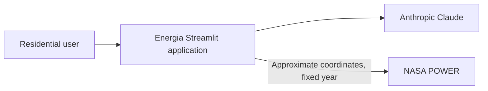
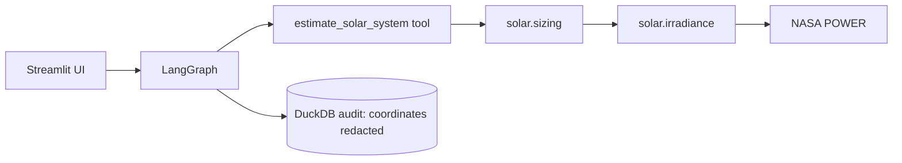

# ADR-009: pvlib and NASA POWER for residential solar sizing

**Status:** Accepted  
**Date:** 2026-08-30  
**Decider:** Daniel Moreira  
**Tags:** solar, pvlib, nasa-power, privacy, cost

## Context

Sprint 3 needs an auditable residential PV feasibility estimate from a user's
location, average consumption, and roof geometry. The repository already
contains a validated NASA POWER client and a locked pvlib dependency. Task 3.4,
which selects real Brazilian modules/inverters, has not yet been implemented.

## Decision

- Use the existing NASA POWER client with the complete 2025 UTC calendar year.
- Reduce validated coordinates to `0.1`-degree precision before sending them
  to NASA POWER, disclose that external recipient in result assumptions, and
  scrub coordinates plus exception details from application-controlled audit
  and error surfaces.
- Use a procedural pvlib/PVWatts chain: interval-midpoint solar position, Erbs
  GHI decomposition, isotropic fixed-plane transposition, SAPM close-mount cell
  temperature, PVWatts DC/default losses/inverter, and a disclosed DC/AC ratio
  of 1.2.
- For the one-kWp reference array, apply default system loss to PVWatts DC,
  define AC nameplate as `1000 / 1.2` watts, and pass
  `pdc0=(1000 / 1.2) / 0.96` with `eta_inv_nom=0.96` to the PVWatts inverter.
- Size continuously to 110% of annualized consumption and round upward to
  0.01 kWp. Reject capacity above the v1 75 kWp microgeneration boundary.
- Keep product selection and discrete module/inverter quantization in Task 3.4.
- Estimate planning cost with the versioned EPE 2025 residential benchmark of
  3150 BRL/kWp. Label it a benchmark, never a vendor quotation.
- Fail explicitly when weather or modeled yield is unusable. Do not return
  stale, fallback, or invented generation.
- Redact coordinates from the existing local DuckDB audit while preserving the
  HR-5 record that the tool was called.

## C4 impact

### Level 1 — system context

### Level 2 — containers/components

No new deployable service or datastore is introduced.

## CAP trade-off

The existing local DuckDB audit remains **CP**: a tool-call record must remain
internally consistent, and coordinate values are redacted before the write.
NASA POWER is an external backing service rather than a datastore selected by
this task. Under a network partition the calculation fails explicitly and
returns no guessed or stale numbers.

## 12-Factor compliance

- **I/II:** same codebase; pvlib, pandas, and requests are already declared and
  locked.
- **III/IV:** no secret or environment-specific endpoint is added; NASA POWER
  remains the existing attached public service.
- **V/VI:** no build change; calculation is stateless.
- **VII/VIII/IX:** no new process, port, worker, or background lifecycle.
- **X:** the same locked calculation runs in tests and the Streamlit process.
- **XI:** sizing emits no logs; audit storage redacts coordinates.
- **XII:** no admin process is added.

## Consequences

### Positive

- Every reported number is produced by a typed domain calculation with explicit
  assumptions and source provenance.
- The implementation is testable without LangChain, Anthropic, or live NASA
  calls.
- The equipment catalog can later quantize the continuous recommendation
  without rewriting the weather-to-power calculation.

### Negative

- One historical year is not a TMY or production forecast.
- Erbs decomposition and generic PVWatts parameters add modeling uncertainty.
- The cost is a planning benchmark and may differ from a real local quote.
- NASA POWER receives approximate coordinates as an external data recipient;
  its own infrastructure is outside the application's no-logging boundary.

## Alternatives

- **Product-specific ModelChain now:** rejected because Task 3.4 owns equipment
  selection and no reviewed catalog exists yet.
- **PVGIS fallback/cache:** rejected for this slice; it could hide a source
  failure and expands the network/data contract.
- **User-supplied cost only:** rejected because the Sprint 3 contract requires a
  cost estimate and the reviewed EPE benchmark provides auditable provenance.
- **Single-division energy heuristic:** rejected because it would ignore roof
  geometry, seasonal irradiance, temperature, and inverter behavior.

## Precedence

For Task 3.2 this ADR and its linked spec supersede the older conceptual
PVGIS, catalog, and payback sketches in `docs/PLAN.md` and `docs/KICKOFF.md`.
Those concerns remain deferred to their later Sprint 3 tasks.

## References

- `docs/PLAN.md`, Sprint 3 Tasks 3.1-3.4.
- `docs/KICKOFF.md`, solar domain/tool split.
- EPE 2025 residential PV cost benchmark:
  <https://www.epe.gov.br/sites-pt/publicacoes-dados-abertos/publicacoes/PublicacoesArquivos/publicacao-305/topico-730/Apresentac%CC%A7o%CC%83es_Workshop%20da%20Previsa%CC%A3o%20de%20Carga%20-%201RQC%20PLAN%202025-2029.pdf>.
- pvlib documentation for `solarposition.get_solarposition`,
  `irradiance.erbs`, `irradiance.get_total_irradiance`,
  `temperature.sapm_cell`, `pvsystem.pvwatts_dc`, and `inverter.pvwatts`.
